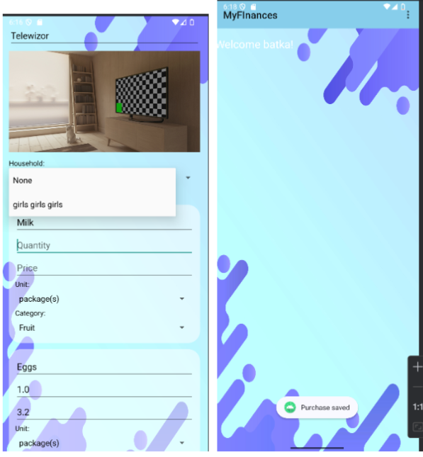
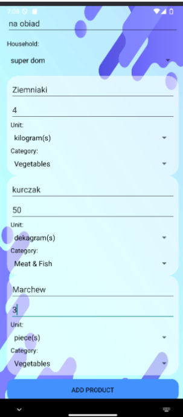
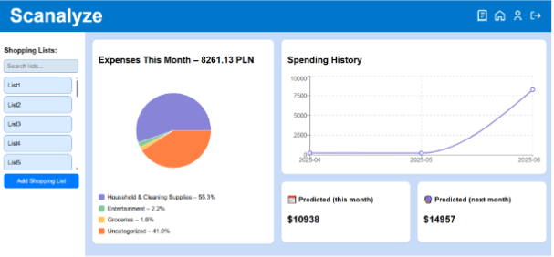
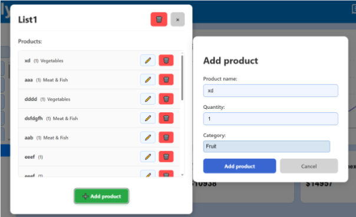
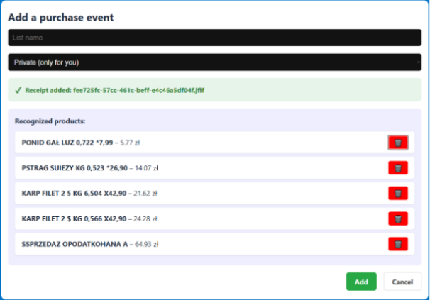
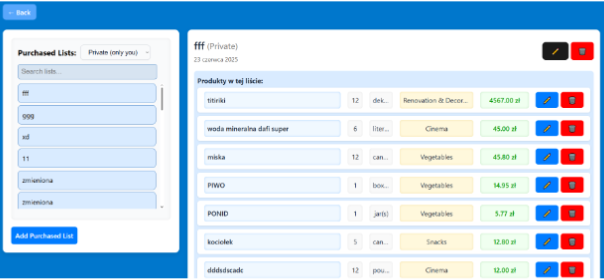

# ZarzadzanieFinansami
 
Aplikacja webowa i mobilna do zarządzania finansami osobistymi i domowymi. Umożliwia rejestrowanie przychodów i wydatków, skanowanie paragonów (OCR), prognozowanie wydatków oraz wizualizację historii zakupów.

------------------
Funkcjonalności
--------------------
- Rejestrowanie przychodów i wydatków

- Tworzenie i edycja list zakupów

- Kategoryzacja wydatków (Jedzenie, Transport, Mieszkanie, Zdrowie, Rozrywka, Inne)

- Skanowanie paragonów i automatyczne rozpoznawanie danych (OCR)

- Wizualizacja historii wydatków i prognozowanie przyszłych kosztów

- Synchronizacja danych między aplikacją mobilną i webową

-----------------
Technologie
----------------
Backend: Python (Flask)

Frontend: React (web), Kotlin (mobile)

Baza danych: PostgreSQL

OCR: EasyOCR

Analiza danych i predykcja: Proste modele statystyczne (średnia krocząca, regresja liniowa)

----------------------------
Podstawowe endpointy API
------------------------------
Użytkownik: rejestracja, logowanie, edycja profilu, usuwanie konta
Gospodarstwo domowe: tworzenie, edycja, usuwanie, zarządzanie członkami i zaproszeniami
Listy zakupów: tworzenie, edycja, usuwanie list i produktów
Wydarzenia zakupowe: dodawanie zakupów, zdjęć paragonów, edycja i usuwanie produktów
Funkcje pomocnicze: OCR paragonów (receiptOCR) i prognozowanie wydatków (estimateExpenses)

------------------------
Aplikacja Mobilna
------------------------

Tworzenie konta i logowanie

Zarządzanie gospodarstwami domowymi

Dodawanie list zakupów i zakupionych produktów

Obsługa paragonów poprzez robienie zdjęć i OCR

Widoki w pionie i poziomie

Przykładowe ekrany:

-------------------
Aplikacja Webowa
-----------------------
Zakładanie konta, logowanie, edycja profilu

Tworzenie i zarządzanie listami zakupów

Wizualizacja wydatków i prognozy

Zarządzanie gospodarstwami domowymi i członkami

Obsługa zdjęć paragonów z OCR

Przykładowe ekrany:

-------------------------
Funkcje pomocnicze
----------------------------
# estimateExpenses(MonthSpent)

Prognozuje wydatki w kolejnym miesiącu na podstawie historii. Wykorzystuje regresję liniową.

# receiptOCR(img)

Przetwarza zdjęcie paragonu i zwraca listę produktów z cenami w formacie dict[str, float].
Wykorzystuje EasyOCR dla lepszej dokładności niż pytesseract.

-------------------
Podsumowanie
--------------------
Aplikacja ułatwia zarządzanie finansami osobistymi i domowymi poprzez:

- Automatyczne rejestrowanie wydatków

- Analizę danych i prognozowanie kosztów

- Ułatwioną obsługę paragonów i zakupów dzięki OCR
